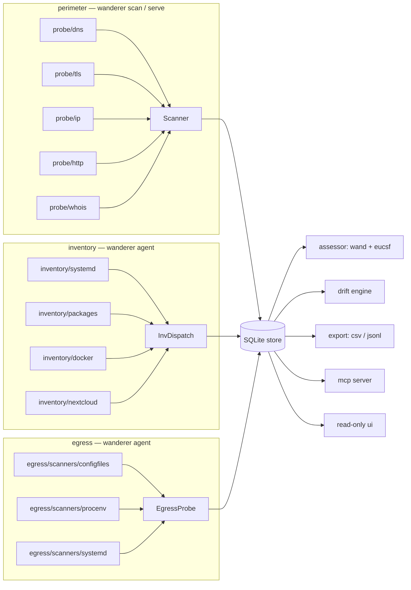

# Architecture

Wanderer is an observation engine. It turns the configuration of a
public-sector estate — domains, hosts, applications — into a stream of
structured `Finding` records, then derives sovereignty assessments
from those findings. Probes do not score. Assessors do not probe. The
`Finding` schema is the wire between them.

## Three modi

Wanderer ships one binary that runs in three operating modi. Each modus
collects evidence the others cannot see; the assessor reads the merged
stream.

### Perimeter — `wanderer scan` / `wanderer serve`

What the outside world sees. Five probes (DNS, TLS, IP, HTTP, WHOIS)
under `internal/probe/{dns,tls,ip,http,whois}`. The scanner runs them
in two passes (see "Two-pass scanning" below) and writes Findings
tagged with `SourceModus = "perimeter"`. Per-capability docs:
[scanner spec](../openspec/specs/scanner/spec.md), nothing else
modus-specific — the probe details live in
[`docs/findings.md`](findings.md).

### Inventory — `wanderer agent` inspectors

What is installed and running on a host. Inspectors live under
`internal/probe/inventory/{systemd,packages,docker,nextcloud}` and
implement the `inventory.Inspector` interface. The agent loops over
the enabled inspectors each tick; failures surface as
`inventory.<id>.unavailable` / `inventory.<id>.error` info Findings
rather than crashing. Findings carry `SourceModus = "inventory"`.
Operator-facing reference: [`docs/agent.md`](agent.md).

### Egress — `wanderer agent` egress probe

Where the data points when it leaves. Static-config-only:
`internal/probe/egress/scanners/{configfiles,procenv,systemd}` walk
config files, `/proc/<pid>/environ`, and systemd unit files; the
classifier (`internal/probe/egress/classify.go`) buckets each value
into a category (`object_storage`, `database`, `oidc`, `smtp`,
`log_shipper`, `webhook`) using a vendor table loaded from
[`internal/probe/egress/vendors.yaml`](../internal/probe/egress/vendors.yaml).
A redactor (`internal/probe/egress/redact.go`) masks anything that
looks like a secret before it reaches the Finding stream. Findings
carry `SourceModus = "egress"`. Reference: [`docs/egress.md`](egress.md).

## Findings as the contract

Every probe and inspector returns `[]models.Finding` and nothing
richer. The shape lives in [`pkg/models/finding.go`](../pkg/models/finding.go);
the catalogue of every ProbeID Wanderer emits, plus the
meta-finding convention (an `error` attribute, `no_answer: true`, or
`unavailable: true` flags non-evidence rows), lives in
[`docs/findings.md`](findings.md).

`models.SourceModus` tags each Finding with the modus that produced
it (`perimeter`, `inventory`, `egress`, `drift`). The assessor's
completeness calculation reads SourceModus to know which evidence it
has, so a perimeter-only scan can correctly mark
inventory-dependent dimensions as `incomplete` rather than scoring
them on absence.

## Cross-cutting consumers

These layers read from the store; none of them probe.

| Component             | Path                                  | Reference                                    |
| --------------------- | ------------------------------------- | -------------------------------------------- |
| Assessor (wand + SEAL) | `internal/assessor/{,wand,eucsf}`      | [`docs/assessor.md`](assessor.md)            |
| Drift engine          | `internal/drift`                      | [`docs/drift.md`](drift.md)                  |
| Exporters (CSV / JSONL) | `internal/export`                     | [`docs/exporters.md`](exporters.md)          |
| MCP server            | `internal/mcp`                        | [`docs/mcp.md`](mcp.md)                      |
| Scheduler (cron)      | `internal/scheduler`                  | [`docs/scheduling.md`](scheduling.md)        |
| Read-only UI          | `internal/ui`                         | [`docs/operator.md`](operator.md)            |

The assessor ships two rule packs side-by-side. **wand**
(Wanderer-NL — inspired by DICTU's *Toetsingsinstrument
Soevereiniteit Clouddiensten*; see ADR-0011) maps Findings into
five dimensions (`juridisch`, `operationeel`, `technologie`,
`data_ai`, `mens`) and four levels (`onbekend` → `afhankelijk`
→ `voldoende` → `soeverein`). **EU CSF (SEAL)** uses five SEAL
levels (SEAL0–SEAL4) over the same Findings. `wanderer assess
--framework wand|eucsf|both` selects which pack(s) run;
persisted Assessments carry a `Framework` tag.

## Key design decisions

### SQLite for the MVP

`modernc.org/sqlite` is pure Go — builds are trivial on any platform
and the database is one auditable file on disk. Migrating to
PostgreSQL later is a `pg_dump`-shaped problem. Starting on Postgres
"because we'll scale" was rejected as premature.

### Schema migrations are numbered, up-only, transactional

`internal/store/migrations.go` runs entries from a `migrations` slice
in numeric order, each in its own transaction. A
`schema_migrations(version, name, applied_at)` table is the source of
truth — an auditor can read one row to know which schema version is
in production. New schema changes append the next version; previous
entries are immutable.

### Probes are packages, not plugins

No plugin loader, no registry with `init()` side effects. The
scanner imports each probe package and calls it; `cmd/wanderer/scan.go::buildProbes`
is the single wiring point. The call graph is static and readable
via `go doc`. Reflection-based dispatch can come later if it ever
earns its keep.

### Partial scans are first-class

A probe that errors, panics, or times out is not a scan failure. The
scanner records the failure as a `<probe>.error` / `.panic` /
`.timeout` finding and continues. An operator gets imperfect output
rather than nothing. A scan is `failed` only when **every** probe
produced no usable findings.

### Two-pass scanning

The perimeter scanner runs every scan in two passes. **Pass 1** runs
DNS, TLS, HTTP, and WHOIS concurrently via `errgroup.WithContext`.
Each probe sees the original Target. **Pass 2** runs only the IP
probe; between the passes, `expandRelatedFromFindings` harvests
subjects from `dns.mx`, `http.third_party`, and `dns.subdomain`
findings into a copy of the Target's `Related` slice. The IP probe
receives the enriched Target so MX hosts and third-party hostnames
get ASN/country lookups. `buildProbes` enforces the order by
returning the IP probe last; the whole scan still runs under one
`context.WithTimeout` so the global budget is a single dial.

### SSRF guard

`internal/probe/ssrf.go` wraps the dialers used by the HTTP and TLS
probes. A static `*net.IPNet` table covers IPv4 loopback,
link-local, RFC1918, CGNAT, and the cloud-metadata IPs
(169.254.169.254, fd00:ec2::254), plus IPv6 ULA and link-local. Any
resolved address that lands in one of those nets is refused at dial
time. Operators who need to scan a private host pass
`--allow-private-targets`; default is on (private blocked). The
`POST /scans` handler refuses requests whose domain resolves only to
private addresses unless the flag was set at server start.

### Read-only operator UI

`internal/ui` ships GET-only routes mounted at `/ui/` under
`wanderer serve --ui`. Authentication is HTTP Basic against an
htpasswd file (bcrypt only; legacy hash algorithms are rejected at
startup). The package contains zero mutating handlers; a static-
analysis test greps the package source for `r.Post|Patch|Delete|Put`
and fails the build if any appear. Anything richer than read-only
browse belongs behind a reverse proxy.

The UI is layered as **DAR — Dashboard, Analysis, Reporting**:

- **Dashboard** (`/ui/`) is a single-page overview of the
  instance: a pontificaal headline (last scan, total scans,
  external + internal coverage counts, frameworks scored), an
  External posture block (perimeter targets, `Kind=domain`), an
  Internal posture block (agent-host targets, `Kind=host`) with
  an explicit empty-state when no agent is reporting yet, plus
  Top concerns and Recent activity.
- **Analysis** (`/ui/targets`, `/ui/scans/{id}`,
  `/ui/scans/{id}/assessment`, `/ui/targets/{id}/drift`) is the
  per-target / per-scan deep-dive surface where an operator
  drills into specific evidence.
- **Reporting** (`/ui/reporting`) is the per-rule cross-target
  view, populated when the sibling `add-reporting-per-check`
  proposal lands.

A small `nav.tmpl` partial renders the same Dashboard / Analysis /
Reporting tabs across every page, so the operator's mental model
of "where am I" is reinforced everywhere. The Reporting tab is
omitted from the rendered HTML when the route is not registered.

## How to add a perimeter probe

1. Create `internal/probe/<name>/` with a type implementing
   `probe.Probe` — `ID() string` and `Run(ctx, target, cfg) ([]Finding, error)`.
2. Emit findings with stable `ProbeID` strings (`<name>.<what>`).
   Probe-specific structured data goes in `Attributes`; raw source
   material (certificate PEMs, DNS record text) goes in `Evidence`.
3. Honour the meta-finding convention for non-evidence rows (an
   `error`, `no_answer`, or `unavailable` attribute).
4. Wire the probe into `cmd/wanderer/scan.go::buildProbes`. Probes
   that need pass-1 outputs (like the IP probe) go last in the
   slice.
5. Document the new ProbeIDs in `docs/findings.md`.

That is the whole integration surface. No framework, no registry.

## How to add an inventory inspector

1. Create `internal/probe/inventory/<id>/` with a type implementing
   `inventory.Inspector` — `ID() string`, `Available() (bool, string)`,
   `Inspect(ctx) ([]Finding, error)`.
2. Emit findings with `ProbeID: inventory.<id>.<what>`. Subject is
   the host's name unless the inspector tracks a sub-entity (e.g. a
   container name). The inventory orchestrator
   (`internal/probe/inventory/inventory.go::Inspect`) tags the
   `SourceModus` for you.
3. If the inspector cannot run (missing socket, missing CLI, wrong
   OS), return `Available() = false, "<reason>"` — the orchestrator
   converts that to an `inventory.<id>.unavailable` info Finding so
   the absence is auditable.
4. Add a config block under `inspectors:` in
   [`internal/agent/config.go::InspectorCfg`](../internal/agent/config.go),
   wire it into `cmd/wanderer/agent.go::buildInspectors`.
5. Document the new ProbeIDs in `docs/findings.md`.

The Docker inspector at `internal/probe/inventory/docker` is a
reference: a stdlib-only `http.Client` over a unix-socket dialer,
read-only GET calls, fixture-driven tests. Copy that shape.

## How to add an egress scanner

1. Create `internal/probe/egress/scanners/<id>.go` with a type
   implementing `scanners.Scanner` — `ID() string`,
   `Available() (bool, string)`, `Scan(ctx) ([]Candidate, error)`.
   A Candidate is a `(source, key, value)` triple — config file
   path, env var name, value to classify.
2. The egress orchestrator
   (`internal/probe/egress/egress.go::Inspect`) hands every
   Candidate to the classifier, redactor, and (when configured)
   IP-resolver before emitting a Finding. Scanners do not classify
   or redact — that is the orchestrator's job, so the contract stays
   uniform.
3. Configure the new scanner in
   [`internal/agent/config.go::EgressConfig`](../internal/agent/config.go);
   wire it into `cmd/wanderer/agent.go::buildEgressProbe`.
4. The classifier's vendor table is loaded from `vendors.yaml`. A
   new vendor (log shipper / webhook host / object-storage prefix)
   is a YAML edit, not a code change.

## How to add a wand rule

1. Add a function returning `assessor.Rule` in
   `internal/assessor/wand/rules.go`, register it in
   `DefaultRules()`. Rule IDs follow `wand.<dimension>.<short_name>`.
2. The rule's `Match` closure consumes `[]models.Finding` and
   returns a `RuleResult`. Filter by `ProbeID` first; for any
   ProbeID where the probe also emits meta rows, route through
   `assessor.IsEvidenceLike` so a non-resolvable domain or a
   missing probe does not score positively on absence.
3. Add a unit test in `rules_test.go` and an integration assertion
   in `integration_test.go` (the integration test wires real probes
   to fake resolvers, so a casing or attribute rename in either
   side breaks the build immediately).
4. The SEAL pack at `internal/assessor/eucsf/rules.go` mirrors the
   wand shape and should learn the same rule when it makes sense
   for the SEAL framework.

## External systems and their failure modes

| System                  | Used by             | Failure handling                                                    |
| ----------------------- | ------------------- | ------------------------------------------------------------------- |
| DNS resolver            | `probe/dns`         | NXDOMAIN / timeout / SERVFAIL → `error` attribute on the Finding    |
| Target `:443` TLS       | `probe/tls`         | Handshake failure → retry with verification off; record both        |
| crt.sh                  | `probe/tls`         | Any failure → `tls.ct.unavailable` Finding; rest of probe continues |
| MaxMind GeoLite2        | `probe/ip`, egress  | Missing/corrupt DB → fail fast at startup, never mid-scan. Setup: see [`docs/operator.md`](operator.md) "GeoLite2 setup" |
| Target `:80` / `:443`   | `probe/http`        | HTTP fallback if HTTPS fails (`http.scheme_downgrade`); body capped at 2 MiB |
| RDAP at `rdap.org`      | `probe/whois`       | 5s timeout; failure → single `whois.unavailable` Finding            |
| Docker socket           | `inventory/docker`  | Missing / EACCES → `inventory.docker.unavailable`; non-2xx → `.error` |
| Wanderer core (remote agent) | `agent.Remote` | 3 retries (0s / 250ms / 1s + jitter), then spool to local outbox    |

## Where to look next

- [`docs/findings.md`](findings.md) — every ProbeID and its attributes
- [`docs/assessor.md`](assessor.md) — wand + SEAL rule packs
- [`docs/agent.md`](agent.md) — agent configuration, trust model,
  outbox spool
- [`docs/egress.md`](egress.md) — egress sources, classifier vendor
  list, redaction
- [`docs/drift.md`](drift.md) — diffing two scans
- [`docs/exporters.md`](exporters.md) — CSV / JSONL exports
- [`docs/mcp.md`](mcp.md) — MCP server over JSON-RPC stdio
- [`docs/scheduling.md`](scheduling.md) — cron-based scan scheduling
- [`docs/operator.md`](operator.md) — running the binary, logs, the
  read-only UI
- [`docs/observability.md`](observability.md) — metrics, tracing, log
  shape
- [`docs/maintainability.md`](maintainability.md) — `CHANGELOG.md`,
  ADRs, package conventions
- [`docs/tutorial.md`](tutorial.md) — end-to-end first-run walkthrough
- [`docs/decisions/`](decisions/) — numbered ADRs for the choices that
  constrain future work
