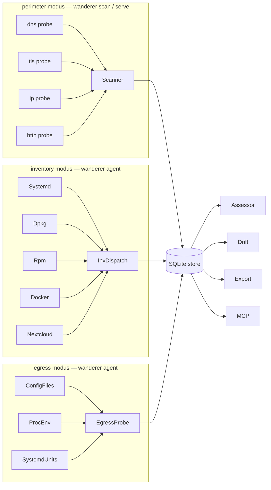

# Design: Refreshed architecture page

## Target outline for `docs/architecture.md`

```
# Architecture

## Three modi



(The diagram above is an outline; the prose section names the
ProbeID prefix each modus owns.)

## Sections

1. **Three modi** — the diagram + one paragraph each.
2. **Findings as the contract** — `pkg/models.Finding` + the
   `SourceModus` taxonomy.
3. **Cross-cutting consumers** — assessor, drift engine,
   exporters, MCP server, scheduler.
4. **How to add a perimeter probe** — refreshed; current code.
5. **How to add an inventory inspector** — new; references
   `internal/probe/inventory/inventory.Inspector`.
6. **How to add an egress scanner** — new; references
   `internal/probe/egress/scanners.Scanner`.
7. **How to add a DICTU rule** — refreshed; references
   `internal/assessor/dictu/rules.go`.
8. **Where to look next** — a flat list of doc links.

## Out of bounds

- No code changes.
- No new ADR — this is documentation, not a decision.

## Test

- Run `markdownlint` (or its absence: a manual readback) before
  commit to catch broken links.
- Verify every link in the file points at an existing path.
